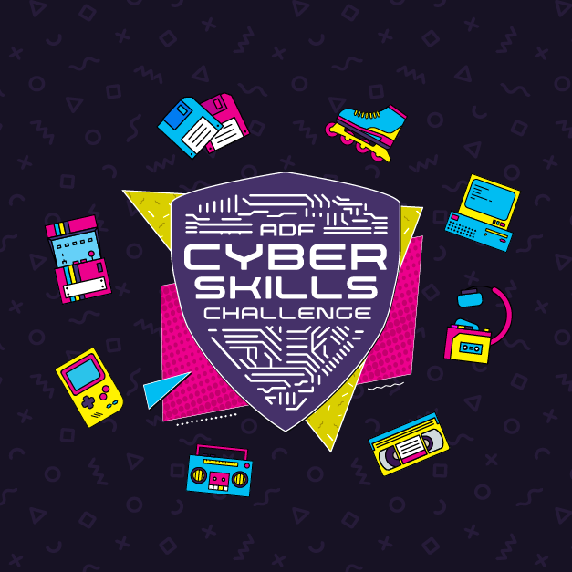

# Welcome


**Mission statement:**&#x20;

_"Provide basic resources to anyone interested in cyber security to build a stronger cyber aware community"_


The pure purpose of Cyber Pals is to provide links to resources to get started with cyber security. There are lots of good sites covering various aspects of cyber security however to find those can be overwhelming for a new starter. This site will hopefully help you to save time and focus on resources that helped others with their Cyber journey.

### Main sections

Our site has a few main focus areas. **Capture the Flag (CTF)** section focuses on a fun way to learn and explore curiosity while solving challenges. **Cyber Pathway** provides recommendations and resources that will help you to get your foot into the Cyber career. The **Tools** section provides links to various tools used by the Cyber community. And finally, the **Vendors** section provides you with resources that are related to specific products used by professionals and businesses.


[cft.md](overview/cft.md)



[cyber-pathway.md](overview/cyber-pathway.md)



[tools.md](overview/tools.md)



[vendors.md](overview/vendors.md)



**Test yourself:** Join us and participate in Cyber Skill Challange. Great way to meet new people and test your skill. Here is a link to last year challenge: [https://www.defence.gov.au/events/adf-cyber-skills-challenge](https://www.defence.gov.au/events/adf-cyber-skills-challenge)


